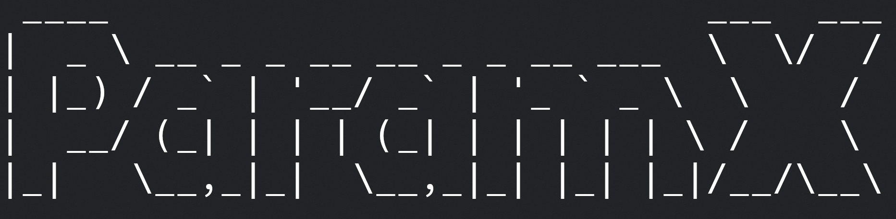

<h1 align="center">
  
   
</h1>

# Install
~~~~~~~~~~~~~~~~~~~~~~~~~~~~~~~~~~~~~~~~~~~~~~~~~~~~~~~~~~~~~~~~~~~~~~~~~
# install julia from this link: https://julialang.org/downloads/
# after install run this commands in terminal:

* 1. julia -e 'using Pkg; Pkg.add("HTTP"); Pkg.add("Gumbo"); Pkg.add("Cascadia"); Pkg.add("ArgParse")'
* 2. git clone https://github.com/mrmeeseeks01/Paramx
* 3. cd Paramx/
* 4. julia Paramx.jl -h

# or you can use docker:

* 1. git clone https://github.com/mrmeeseeks01/Paramx
* 2. cd Paramx/
* 3. docker build -t paramx .
* 4. docker run -it paramx
* 5. press ; to enabled shell mode
* 6. julia Paramx.jl -h

~~~~~~~~~~~~~~~~~~~~~~~~~~~~~~~~~~~~~~~~~~~~~~~~~~~~~~~~~~~~~~~~~~~~~~~~~~

# Intro
~~~~~~~~~~~~~~~~~~~~~~~~~~~~~~~~~~~~~~~~~~~~~~~~~~~~~~~~~~~~~~~~~~~~~~~~~~
# help to find:

* Parameter names
* <input> tag's name & id values
* <a> tags href inner parameters
* js variables names
* js object keys
* php variables names
* php $_GET, $_POST valuse
* Files names with given extensions
* Urls

# read from:

* Url(s)
* File(s)
~~~~~~~~~~~~~~~~~~~~~~~~~~~~~~~~~~~~~~~~~~~~~~~~~~~~~~~~~~~~~~~~~~~~~~~~~~

# Switches
~~~~~~~~~~~~~~~~~~~~~~~~~~~~~~~~~~~~~~~~~~~~~~~~~~~~~~~~~~~~~~~~~~~~~~~~~~
# optional arguments:
*  -h, --help            show this help message and exit

# INPUT switches:
*  -u, --url             single url to crawl
*  -U, --urls            multiple urls in file to crawl
*  -S, --source          saved html source code
*  -R, --request         sent http request in file
*  -P, --response        received http response in file
*  --js                  find parameters in js file
*  --php                 find parameters in php file

# WORK switches:
*  -a                    find parameters in herf of <a> tag
*  -i                    find <input> <textarea> tag parameters [name, id]
*  -s, --script          find <script> tag variables names & objects keys
*  -p                    find parameters in request or response or js or php content
*  -f, --file-names      find file names
*  -e, --extension       extension(s) of files to search, must be in space separated; default is js
*  -w                    find urls
*  -A                    do all -a -i -s -f -u -w

# save switches:
*  -o, --output OUTPUT   save output in file
~~~~~~~~~~~~~~~~~~~~~~~~~~~~~~~~~~~~~~~~~~~~~~~~~~~~~~~~~~~~~~~~~~~~~~~~~~

# Examples

* find js variables names & objects keys from url
~~~
> julia Paramx.jl -u [url] -s
~~~
* find name & id attribute values in <input> <textarea>
~~~
> julia Paramx.jl -u [url] -i
~~~
* find parameters inside href attribute of <a>
~~~
> julia Paramx.jl -u [url] -a
~~~
* find files with give extensions; if dont pass -e only finds js by default
~~~
> julia Paramx.jl -u [url] -f -e "js" "php" ["any"]
~~~
* find urls
~~~
> julia Paramx.jl -u [url] -w
~~~
* you can do multiple work with together
~~~
> julia Paramx.jl -u [url] -s -a -i
~~~
* find all above
~~~
> julia Paramx.jl -u [url] -A -e "js" "html" "xml"
~~~
* find all above and save output
~~~
> julia Paramx.jl -u [url] -A -e "js" "html" "xml" -o file.txt
~~~
* read file line by line and do same for each url
~~~
> julia Paramx.jl -U [file] -[WORK switches]
~~~
* find parameters by give swithes in saved html source code
~~~
> julia Paramx.jl -S [file] -[WORK switches]
~~~
* find parameters by give swithes in sent http request file
~~~
> julia Paramx.jl -R [file] -[WORK switches]
~~~
* find parameters by give swithes in received http response file
~~~
> julia Paramx.jl -P [file] -[WORK switches]
~~~
* find variables names & objects keys by in javascript file
~~~
> julia Paramx.jl --js [file.js] -p
~~~
* In addition to the above finds urls and files too
~~~
> julia Paramx.jl --js [file.js] -p -w -f [extension]
~~~
* find variable names and $_GET * $_POST values in php file
~~~
> julia Paramx.jl --php [file.php] -p
~~~
* In addition to the above finds urls and files too
~~~
> julia Paramx.jl --php [file.php] -p -w -f [extension]
~~~